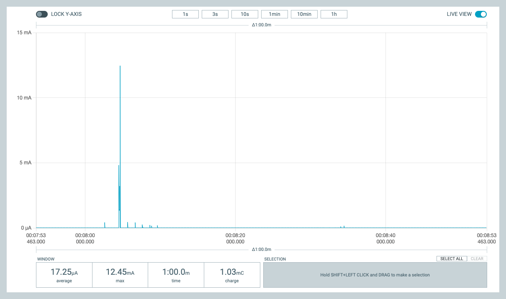
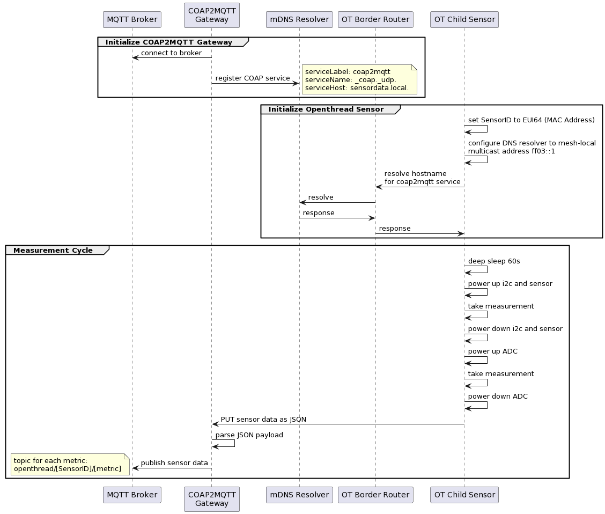

# ot-sensor-lp
Broadcasting Sleepy Thread Device with a BME280 sensor on a Nordic nRF52840 Dongle (PCA10059). Programmed with nRF Connect for Desktop/Zephyr.

As there is no support for OpenThread in Arduino, I'm trying my luck with the Nordic nRF Connect SDK/Zephyr. 
After struggling with the new concepts in Zephyr (device tree and overlay files), here is the first working example.
It sends a JSON datagram with battery voltage, temperature, humidity and air pressure data from a BME280 I2C sensor over COAP/UDP and goes to sleep for 60 seconds.

Giving up on low power with the Zephyr SDK and device tree drivers. It's just not possible with its core concept of a device tree.
* the i2c bus and the device (sensor) is exclusively initialized during boot.
* there is no way to power-up/initialize a sensor device during runtime
* there is no way to de-initialize/power-down a sensor device during runtime

So I'm trying brute force methods:
* only use the i2c bus as a device from the device tree
* directly use the sensor with i2c commands and register voodoo
* the sensor can now be powered and switched off by a GPIO pin.
* deep sleep current is now 12µA

PPK2 measurement over a full 1 minute cycle (Nordic nRF52840 Dongle, BME280)

### UML Sequence Diagram

